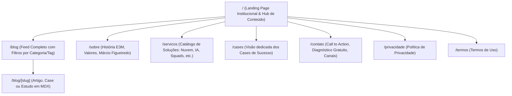

# HLD-001: Arquitetura de Conteúdo, Informação e Curadoria de Referências

## 1. Contexto e Diagnóstico das Referências

A análise do ecossistema existente revelou dois pilares complementares que devem ser unificados estrategicamente no novo portal:

### 1.1. E3M Solutions (`e3m.dev.br` - Legado Hashnode)
* **Posicionamento & Proposta de Valor:** Soluções em Nuvem, Desenvolvimento, Inteligência Artificial, Consultoria, Arquitetura, Squads, Recrutamento Tech e Upskilling.
* **Histórico e Autoridade:** Empresa atuando há 25+ anos no mercado sob liderança de Márcio Figueiredo (27+ anos de experiência na área de engenharia de software e liderança tech na Globo).
* **Cultura Operacional:** Estrutura digital, enxuta e descentralizada ("Seu projeto, seus objetivos, suas regras; foco no problema e resultados práticos sem amarras burocráticas").
* **Acervo Atual de Cases Reais:**
  1. *Afiliadas de Emissoras:* Solicitações de Materiais e Comunicação (App Web & Mobile).
  2. *Gestão de Playout e Mídia:* Grades de Programação integradas a Playout de emissoras.
  3. *Setor Contábil:* Plataforma de Recomendações e integrações para contabilidades.
  4. *Digital Signage:* Solução de exibição e mídia indoor conectada.
  5. *Franquias e Beleza:* Plataforma integrada de agendamento de clientes, gestão de estabelecimentos e backoffice de parcerias.
  6. *Marketing & Saúde:* Lançamentos e presença digital para terapias holísticas.
* **Artigos Técnicos em Destaque:**
  - Modernização e construção de aplicações em Nuvem.
  - Serverless na prática (Cloud Functions na GCP).
  - IA e automações para pequenas empresas e startups.
  - Agilidade aplicada a projetos de escopo, prazo e orçamento rígidos.

### 1.2. Márcio Figueiredo (`marcio.dev.br` - BLIP)
* **Conceito:** *Build and Learn in Public (BLIP)*.
* **Foco:** Compartilhamento de aprendizados, spikes de código, trilhas para certificação, vagas curadas de TI e mentoria de carreira tech.

---

## 2. Nova Arquitetura de Informação do Portal E3M

O novo portal terá duas dimensões que se reforçam mutuamente:
1. **Dimensão Institucional e Comercial:** Transmite autoridade, confiança, maturidade técnica de 25+ anos e oferece canais claros de conversão ("Tem um projeto?", "Vamos conversar?", diagnóstico gratuito).
2. **Dimensão Editorial e de Conteúdo (Tech Hub):** Vitrine viva de artigos técnicos, cases detalhados, estudos, tutoriais de IA e experimentações.

### 2.1. Mapa de Rotas do Site



---

## 3. Taxonomia e Contrato de Conteúdo (MDX Content Collections)

Para unificar artigos de opinião, cases, spikes de IA, dicas de certificação e serviços no mesmo pipeline estático sem confusão, todo arquivo em `src/content/blog/` adotará uma taxonomia tipada:

### 3.1. Tipos de Conteúdo (`type`)
* `case`: Estudo de caso de cliente/projeto real com problema, solução e resultados.
* `service`: Apresentação aprofundada de uma linha de serviço E3M.
* `article`: Artigos técnicos profundos de engenharia, nuvem e arquitetura.
* `experiment`: Spikes, provas de conceito e experimentações de IA / novas stacks.
* `saas`: Lançamentos de micro-produtos e soluções digitais E3M.
* `track`: Trilhas de estudo, guias de certificação e dicas de upskilling.
* `opinion`: Artigos de opinião sobre agilidade, tendências de mercado e liderança tech.
* `recommendation`: Vagas, ferramentas e recomendações de software.

### 3.2. Estrutura do Frontmatter (Validação Zod)
```yaml
---
title: "Título do Post"
description: "Resumo de até 160 caracteres otimizado para SEO e cards."
date: 2026-09-10
author: "Márcio Figueiredo"
type: "case" # case | service | article | experiment | saas | track | opinion | recommendation
tags: ["Nuvem", "GCP", "Serverless"]
coverImage: "./assets/post-cover.webp"
draft: false
featured: true # Destaque na Home
projectUrl: "https://..." # Opcional para cases ou saas
---
```

---

## 4. Componentes Institucionais e Pontos de Conversão

No design Glassmorphism escuro, serão introduzidos blocos reutilizáveis:
1. **Banner "Tem um Projeto? Vamos Conversar":** Bloco com fundo de vidro, bordas luminosas e CTA com link direto para WhatsApp/Email/Agendamento de Diagnóstico Gratuito.
2. **Card de Case de Sucesso:** Exibição elegante do cliente/nicho, desafio, stack utilizada e link para o estudo completo.
3. **Filtro Rápido por Pílulas (Pills):** Permite ao visitante alternar entre "Todos", "Cases", "Nuvem & Arquitetura", "Inteligência Artificial", "Trilhas de Estudo".
